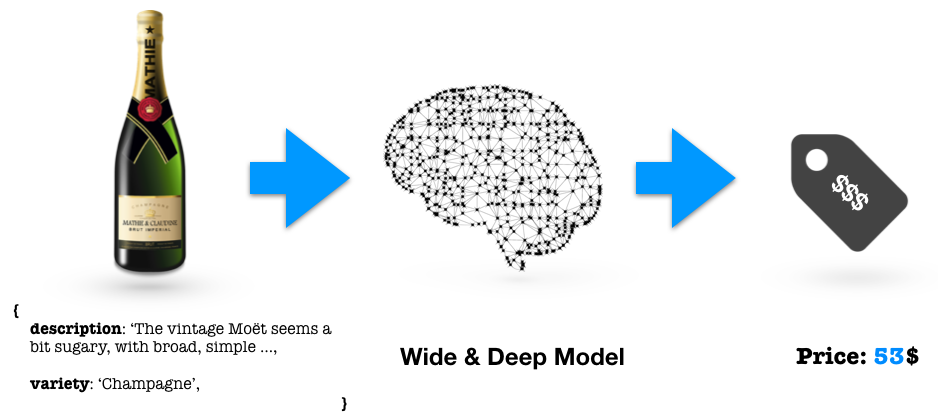

# regression-template

Predicting the price of an object given the historical data is one of the most common task of [ML](https://en.wikipedia.org/wiki/Machine_learning), usually achieved with the [Linear Regression model](https://en.wikipedia.org/wiki/Linear_regression). In this project the Linear Layer will be only the top of the iceberg of a model which combines the wideness of ML model and the deepness of DL model for NLP. The goal is to predict the price of a wine from its description (and variety).

### Try it now

Click this button to open a Workspace on FloydHub that will train this model.

### Predicting price of wine

In this notebook, we will build a classifier to correctly predict the price of a wine from its description. More in detail, we will combine the strength of ML and DL learning using a [Wide & Deep Model](https://medium.com/tensorflow/predicting-the-price-of-wine-with-the-keras-functional-api-and-tensorflow-a95d1c2c1b03), which provides really good performance for Regression and Recommendation tasks.

We will use the [Kaggle's Wine Reviews](https://www.kaggle.com/zynicide/wine-reviews) dataset for training our model. The dataset contains 10 columns and 150k rows of wine reviews.

We will:
- Preprocess text data for NLP
- Build and train a [Wide & Deep model](https://ai.googleblog.com/2016/06/wide-deep-learning-better-together-with.html) using Keras and Tensorflow
- Evaluate our model on the test set
- Run the model on your own movie reviews!
